### École : ENSEA

### Matière : Conception de Circuits Numériques

### TP : TP1 — FIFO Élastique Synchrone

### Étudiants : Elton MBOUMELA, Tom COMPACHON

# Rapport de TP1 : Modélisation et Implémentation d'une FIFO Élastique Synchrone

## Objectifs

- Étudier la méthodologie et les aspects avancés de VHDL.
- Concevoir et modéliser une FIFO élastique synchrone.

## Cahier des Charges

L'objectif principal est de concevoir une FIFO élastique synchrone, où l'écriture des données est asynchrone et la lecture est synchrone. Les spécifications incluent :

- Taille paramétrable de la FIFO.
- Séquencement interne réalisé à partir d'une horloge externe de 10 MHz.
- Fréquence de lecture de 50 kHz.
- Gestion des signaux `fast` et `slow` pour éviter le débordement et le vidage de la FIFO.

## Démonstration des Blocs

### 1. Mémoire RAM

- Description d'une RAM paramétrée.
- Test de l'écriture et de la lecture de données.
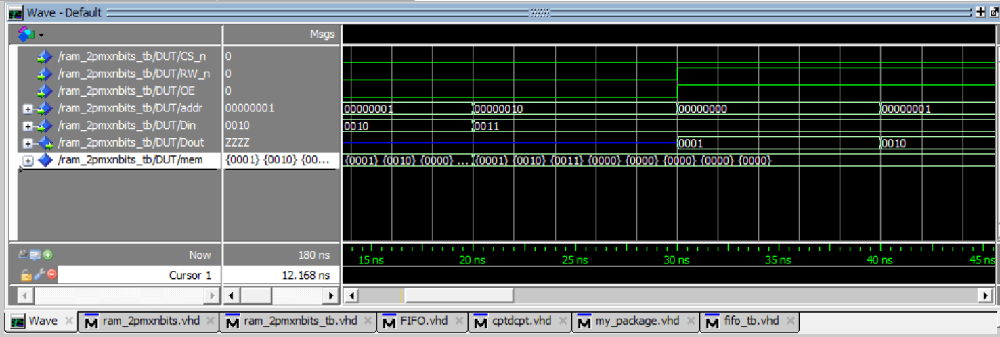

### 2. Compteur/Décompteur

- Développement d'un compteur décompteur paramétrable.
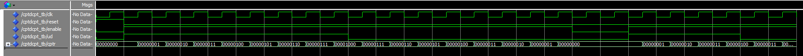
  
### 3. Générateur d'Horloge de Lecture (GENHL)

- Calcul des signaux ENREAD et ENWRITE.
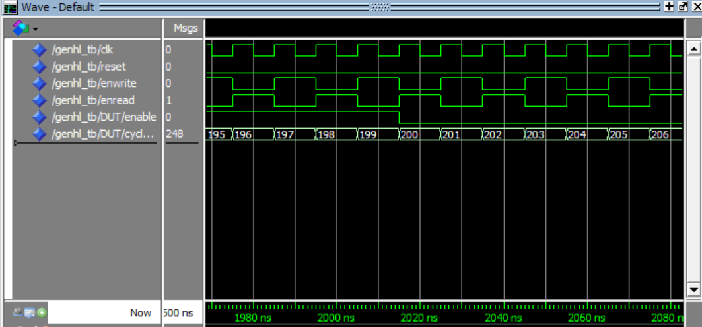

### 4. Générateur d'Adresse

- Utilisation de compteurs et d'un multiplexeur.
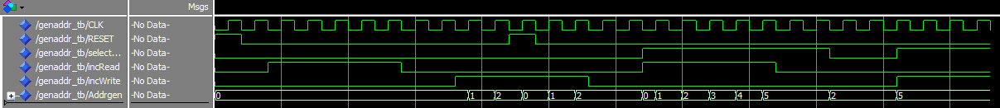

### 5. Fast/Slow

- Calcul des signaux `fast` et `slow` pour la gestion de la FIFO.
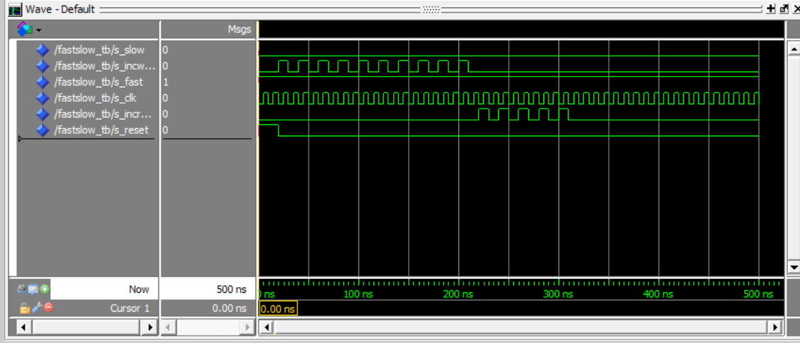

### 6. Complément à 2 et Registre N bits

- Fonction pour le complément à 2 et vérification des temps de pré-positionnement et de maintien.
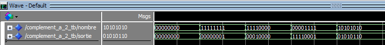

### 7. Séquenceur

- Graphique des Transitions

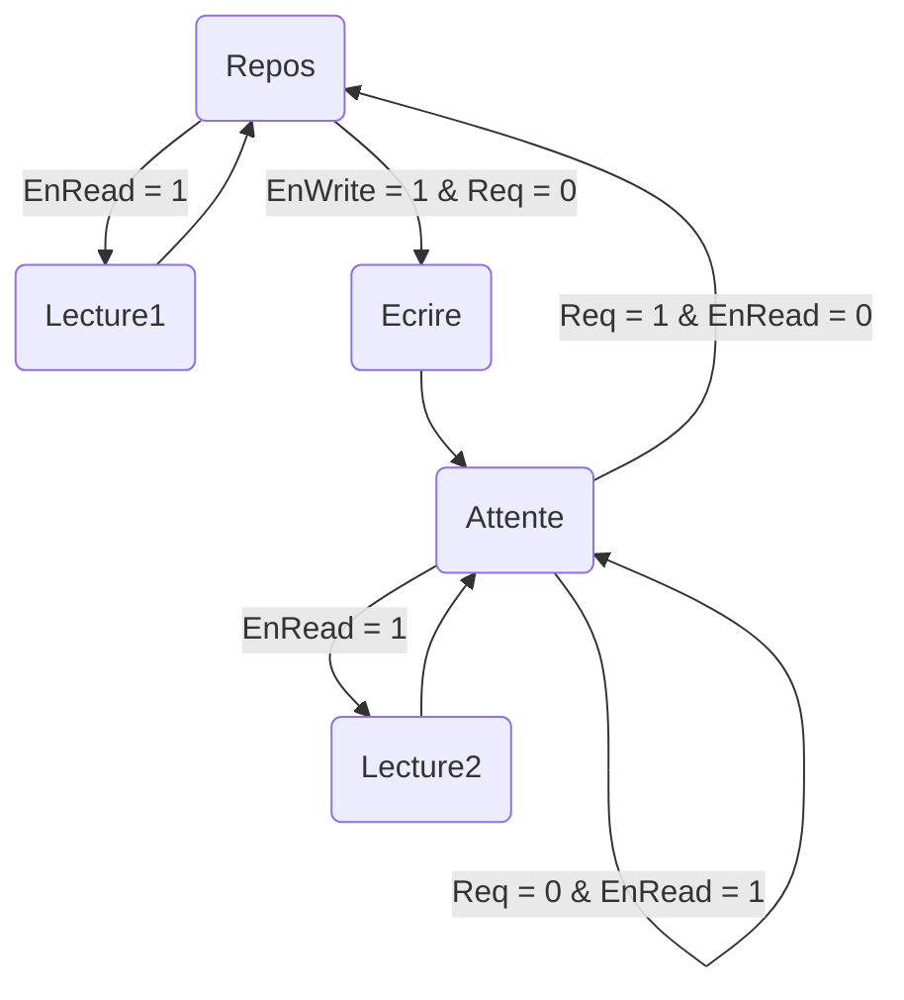

- Description de deux architectures (Moore et Mealy) et simulation.

Mealy sync
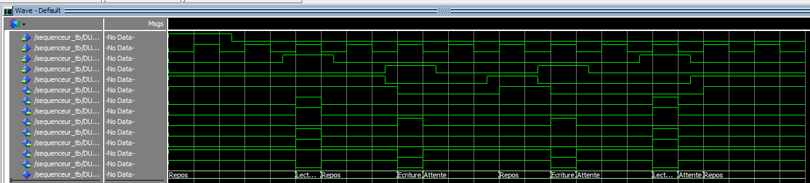

Mealy Imm
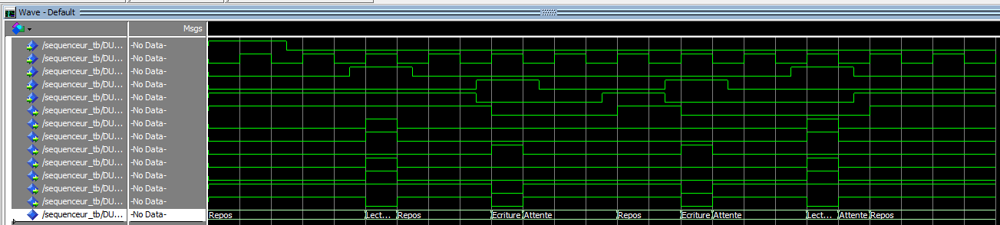

Moore sync

Moore imm
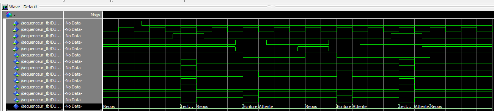

## Interconnexion des Blocs

- Assemblage des composants pour créer la FIFO élastique.
- Testbench pour valider le fonctionnement de la FIFO.

## Synthèse et Implémentation

- Synthèse de la FIFO avec Vivado.

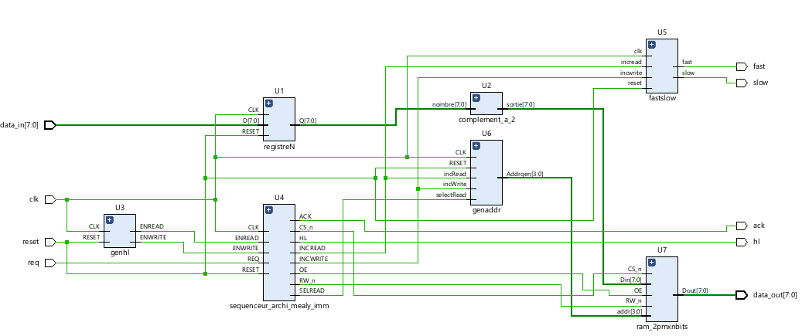

- Test sur la carte FPGA. (non fait)

## Conclusion

La FIFO élastique synchrone a été modélisée et testée avec succès. Tous les blocs fonctionnent selon les spécifications fournies. Un rapport de synthèse et des chronogrammes de simulation sont disponibles pour évaluation. De plus, la synthse sous Vivado à été effectué.

## Annexes

- Code VHDL des différents blocs.
- Fichiers de test et de configuration.
